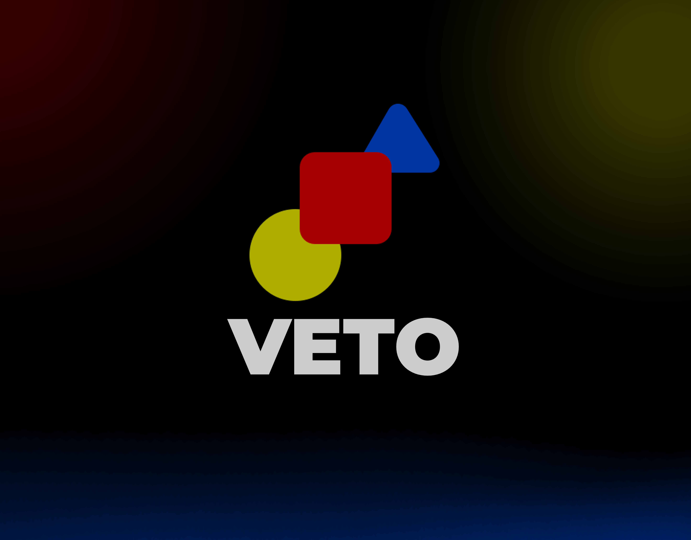

<p align="center">
  
</p>

<p align="center">
  <a href="https://github.com/datekt/veto/actions/workflows/ci.yml"></a>
  <a href="LICENSE"></a>
  
  
</p>

---

# Veto

**Veto** is a lightning-fast, zero-noise CLI utility written in Rust. It is designed
to act as a strict quality gate for your codebase. Unlike traditional linters that
overwhelm you with cosmetic warnings, Veto has a single mission: **detect only
critical, fatal bugs that will prevent your code from executing, and cast a Veto on
your build.**

It runs near-instantaneously, outputs clean logs to the terminal, and generates a
structured JSON report perfect for CI/CD integrations.

## Features

- **Zero Noise** — only catches breaking, fatal issues (show-stoppers). No stylistic warnings.
- **Blazing Fast** — built with Rust, using data-parallel scanning via `rayon`.
- **Machine Readable** — generates a clean JSON report with precise location and context data.
- **CI/CD Ready** — returns exit code `1` upon finding any critical bugs, stopping broken builds.
- **Interactive Mode** — run `veto` with no arguments to open a guided terminal menu (in Russian).

## What Does It Detect?

| ID   | Pattern          | Meaning                                             |
| ---- | ---------------- | --------------------------------------------------- |
| V001 | `<<<<<<<`        | Unmerged Git conflict marker.                       |
| V002 | `>>>>>>>`        | Unmerged Git conflict marker.                       |
| V003 | `\|\|\|\|\|\|\|` | Unmerged Git conflict marker (diff3 style).         |
| V004 | `TODO_CRITICAL`  | Critical TODO marker present in source.             |
| V005 | `FIXME_CRITICAL` | Critical FIXME marker present in source.            |
| V006 | `XXX_CRITICAL`   | Critical XXX marker present in source.              |

Binary files (detected via a null-byte probe of the first 8 KiB) are silently skipped.

## The JSON Report Structure

### CLI Mode — Single `errors.json`

```json
{
  "total_critical_bugs": 1,
  "scanned_at": "2026-10-01T21:57:00Z",
  "errors": [
    {
      "id": "V001",
      "file": "src/main.rs",
      "line": 42,
      "column": 1,
      "message": "Unmerged git conflict marker detected.",
      "context": "<<<<<<< HEAD"
    }
  ]
}
```

### Interactive Mode — Per-File Tree Under `errors/`

Each offending file produces its own report, mirroring the source layout:

```
errors/
  src/
    main.rs.json
  lib/
    parser.rs.json
```

## Installation

### Prebuilt Binaries

Grab the archive for your platform from the
[Releases](https://github.com/datekt/veto/releases) page:

- `veto-linux-x86_64`
- `veto-windows-x86_64.exe`
- `veto-macos-x86_64`

### From Source

Ensure you have the Rust toolchain installed, then:

```bash
git clone https://github.com/datekt/veto
cd veto
cargo build --release
```

The compiled binary will be available at:

- Linux / macOS: `./target/release/veto`
- Windows: `./target/release/veto.exe`

## Usage

### CLI Mode

```bash
# Scan the current directory (writes errors.json)
veto .

# Scan a specific file or folder and write to a custom report path
veto path/to/file.rs --output custom-report.json

# Quiet mode — suppress console output, only update the JSON file
veto . --quiet
```

### Interactive Mode

```bash
veto
```

Opens a terminal menu with a tutorial, folder picker, and file picker.

### Exit Codes

- `0` — **Passed.** No critical bugs detected.
- `1` — **Vetoed.** Critical bugs found. Check the console or the JSON report.
- `2` — **Execution error.** Failed to read files or invalid arguments.

## Building Release Binaries for All Three OSes

The repository ships with a cross-platform GitHub Actions workflow
(`.github/workflows/release.yml`). Pushing a tag matching `v*` triggers a build
matrix that produces a native binary for each target:

| OS      | Target Triple              | Asset Name                |
| ------- | -------------------------- | ------------------------- |
| Linux   | `x86_64-unknown-linux-gnu` | `veto-linux-x86_64`       |
| Windows | `x86_64-pc-windows-msvc`   | `veto-windows-x86_64.exe` |
| macOS   | `x86_64-apple-darwin`      | `veto-macos-x86_64`       |

To cut a release:

```bash
git tag v0.1.0
git push origin v0.1.0
```

The workflow uploads all three binaries to the corresponding GitHub Release.

## Contributing

Contributions are welcome! Please check out [CONTRIBUTING.md](CONTRIBUTING.md)
for setup, formatting guidelines, and the checklist that CI enforces.

## License

This project is licensed under the MIT License — see the [LICENSE](LICENSE) file
for details.